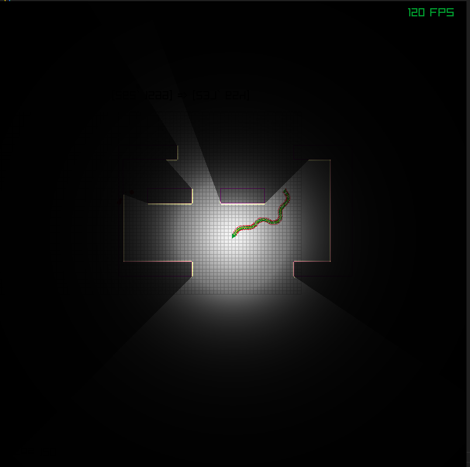
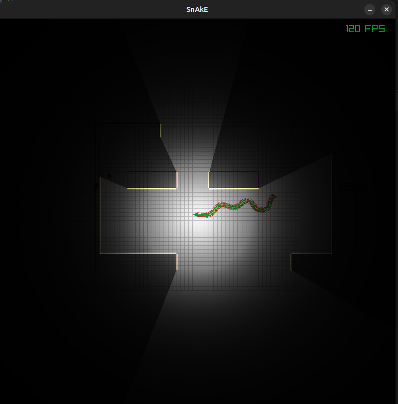

prototyping a snake game in c++/raylib

it features

* offline rendering of the scene ( render to texture)
* a compute shader wich perfoms 2d ray cast to add shadows around the snake on the walls

